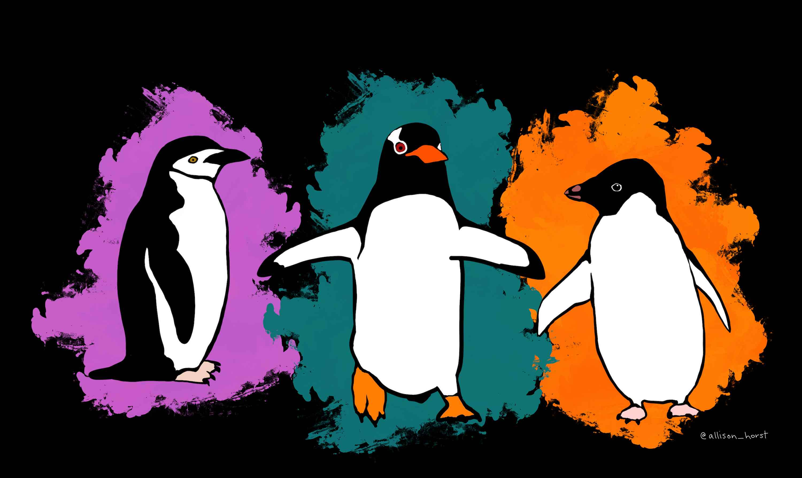
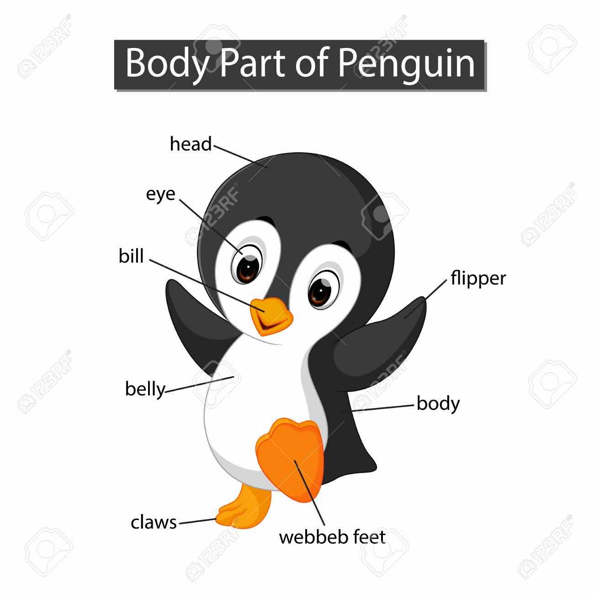

```{r setup, include=FALSE}
knitr::opts_chunk$set(echo = TRUE)
library(tidyverse)
library(janitor)
library(lubridate)
```

# Meet the Penguins

The Palmer Penguins dataset contains size measurements, clutch observations, and blood isotope ratios for three penguin species: **Adelie**, **Chinstrap**, and **Gentoo**, observed on three islands in the Palmer Archipelago, Antarctica (2007–2009).

This project explores their story through tidy data and reproducible R code.

```{r import-data}
penguins_raw <- read_csv("https://raw.githubusercontent.com/esnzgn/DataViz-R-Course/main/data/penguins_raw.csv") |> clean_names()

head(penguins_raw)
```






# Cleaning the Data

```{r clean-data}
penguins <- penguins_raw |> 
  filter(!is.na(species)) |> 
  mutate(sex = factor(sex), species = factor(species), island = factor(island))

penguins
```

# Summary Statistics

```{r summary-stats}
summary(penguins)
```

# Penguin Population by Species and Island

```{r bar-plot}
penguins |> 
  count(species, island) |> 
  ggplot(aes(x = island, y = n, fill = species)) +
  geom_col(position = "dodge") +
  labs(title = "Penguin Count by Species and Island", x = "Island", y = "Count")
```

# Bill Length vs Depth

```{r scatter-plot}
ggplot(penguins, aes(x = culmen_length_mm, y = culmen_depth_mm, color = species, shape = sex)) +
  geom_point(alpha = 0.7) +
  labs(title = "Bill Length vs Depth", x = "Bill Length (mm)", y = "Bill Depth (mm)")
```

# Flipper Length and Body Mass by Species

```{r box-plots}
penguins |> 
  pivot_longer(c(flipper_length_mm, body_mass_g), names_to = "trait", values_to = "value") |> 
  ggplot(aes(x = species, y = value, fill = species)) +
  geom_boxplot() +
  facet_wrap(~trait, scales = "free_y") +
  labs(title = "Flipper Length and Body Mass by Species")
```

# Sex Distribution

```{r sex-distribution}
penguins |> 
  count(sex, species) |> 
  ggplot(aes(x = species, y = n, fill = sex)) +
  geom_col(position = "dodge") +
  labs(title = "Sex Distribution by Species", y = "Count")
```

# Conclusion

The Palmer Penguins offer a beautiful story of biodiversity, adaptation, and scientific discovery. Using R, we visualize and explore how size, sex, species, and geography shape this Antarctic tale.

Data from Gorman et al. (2014) via [palmerpenguins R package](https://journal.r-project.org/articles/RJ-2022-020/RJ-2022-020.pdf).
