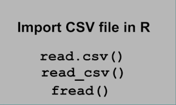
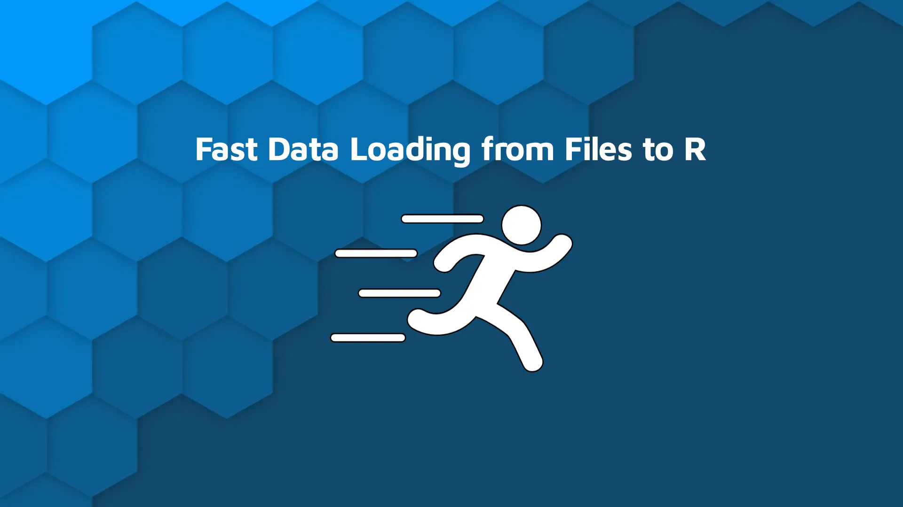

```{r setup, include=FALSE}
knitr::opts_chunk$set(echo = TRUE)
library(readr)
library(data.table)
library(readxl)
library(dplyr)
```



## 1. Introduction

Welcome to today’s session on **Importing Datasets from CSV, Excel, and
Online Repositories**. In this session, we’ll explore various data input
(I/O) techniques in R, including base functions and powerful packages
like `readr`, `data.table`, and `readxl`. We'll also access datasets
from online sources and save them in different formats.

## 2. Example 1: Import a CSV file using `read.csv`

```{r}
# R base
iris_data <- read.csv("https://raw.githubusercontent.com/esnzgn/DataViz-R-Course/main/data/iris.csv")
head(iris_data)
```

## 3. Example 2: Import a CSV file using `read_csv`

```{r}
# lib readr
iris_readr <- read_csv("https://raw.githubusercontent.com/esnzgn/DataViz-R-Course/main/data/iris.csv")
iris_readr
```

## 4. Example 3: Import a CSV file using `fread`



```{r}
# lib data.table
iris_dt <- fread("https://raw.githubusercontent.com/esnzgn/DataViz-R-Course/main/data/iris.csv")
iris_dt
```

## 5. Example 4: Import an Excel file

```{r}
excel_example <- read_excel("../data/mtcars.xlsx")
head(excel_example)
```

## 6. Example 5: Reading only specific columns with `fread`

```{r}
small_iris <- fread("https://raw.githubusercontent.com/esnzgn/DataViz-R-Course/main/data/iris.csv",
                    select = c("Sepal.Length", "Species"))
head(small_iris)

# do the same as above from the locl repo
small_iris_2 <- fread("../data/iris.csv",
                    select = c("Sepal.Length", "Species"))
head(small_iris_2)
```

## 7. Example 6: Reading limited rows with `read_csv`

```{r}
few_rows <- read_csv("https://raw.githubusercontent.com/esnzgn/DataViz-R-Course/main/data/iris.csv", n_max = 5)
few_rows
```

## 8. Example 7: Saving datasets to CSV and Excel

```{r}
write.csv(iris_data, "iris_copy.csv", row.names = FALSE)
writexl::write_xlsx(iris_data, "iris_copy.xlsx")
```

## 9. Example 8: Load a built-in dataset and save it

```{r}
data("mtcars")
write.csv(mtcars, "mtcars.csv")
```

## 10. Example 9: Reading a dataset using `skip` in `fread`

```{r}
skip_iris <- fread("https://raw.githubusercontent.com/esnzgn/DataViz-R-Course/main/data/iris.csv", skip = 5)
head(skip_iris)
```

## 11. Example 10: Column filtering with `read_csv`

```{r}
read_select <- read_csv("https://raw.githubusercontent.com/esnzgn/DataViz-R-Course/main/data/iris.csv",
                        col_select = c("Species", "Petal.Width"))
head(read_select)

# Use read_csv() to load the mtcars.csv and filter rows with mpg > 20
mtcars_csv_orgin <- read_csv("../data/mtcars.csv")
colnames(mtcars_csv_orgin)
mtcars_above_20mpg <- subset(mtcars_csv_orgin, mpg > 20)

mtcars_above_20mpg_dplyr <- mtcars |> 
  filter(mpg > 20)
```

## Exercises

1.  Load the `penguins` dataset from `palmerpenguins` and save it
    locally.
2.  Read the saved dataset using `fread`.
3.  Use `read_csv()` to load the `mtcars.csv` and filter rows with mpg
    \> 20.

These examples demonstrate a variety of efficient ways to import and
work with datasets in R. Be mindful of the size and structure of your
files to optimize performance.

#One last thing about timing

csv_name \<- "surveys.csv"

read.table.timing \<- system.time(read.table(csv_name, header = TRUE,
sep = ",")) readr.timing \<- system.time(read_delim(csv_name, delim =
",", col_names = TRUE)) data.table.timing \<- system.time(allData \<-
fread(csv_name, showProgress = FALSE)) data \<- data.frame(method =
c('read.table', 'readr', 'fread'), timing = c(read.table.timing[3],
readr.timing[3], data.table.timing[3])) data method timing read.table
0.121 readr 0.549 fread 0.007
