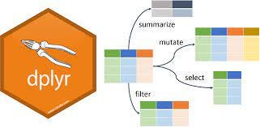
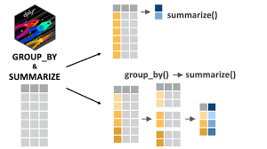

```{r setup, include=FALSE}
knitr::opts_chunk$set(echo = TRUE)
```


# Introduction

In this session, we will explore **data wrangling with `dplyr`** using the **Palmer Penguins** dataset. This dataset offers a rich example of real-world biological data and is a great substitute for the iris dataset.

We'll cover:
- Cleaning and renaming variables
- Subsetting columns and rows
- Creating new variables
- Group-wise summary
- Working with missing data and factors



# Load Packages

```{r load-packages}
library(tidyverse)
library(janitor)
library(palmerpenguins)
library(lubridate)
```

# Load and Explore Raw Data

```{r load-data}
penguins_raw <- penguins
glimpse(penguins_raw)
```

## Clean Column Names

```{r clean-names}
penguins_clean <- clean_names(penguins_raw)
colnames(penguins_clean)
```

## Rename Columns

```{r rename-columns}
penguins_clean <- penguins_clean |> 
  rename(delta_15n = delta_15_n_o_oo,
         delta_13c = delta_13_c_o_oo)
```

## Rename Text Values
 
```{r rename-text}
penguins_clean <- penguins_clean |> 
  mutate(species = case_when(
    species == "Adelie Penguin (Pygoscelis adeliae)" ~ "Adelie",
    species == "Gentoo penguin (Pygoscelis papua)" ~ "Gentoo",
    species == "Chinstrap penguin (Pygoscelis antarctica)" ~ "Chinstrap",
    TRUE ~ species
  ))
```

## Select Columns

```{r select}
penguins_selected <- penguins_clean |> 
  select(species, sex, flipper_length_mm, body_mass_g)
```

## Filter Rows

```{r filter}
adelie_penguins <- penguins_selected |> 
  filter(species == "Adelie")
```

## Arrange Rows

```{r arrange}
arranged_penguins <- penguins_selected |> 
  arrange(desc(flipper_length_mm))
```

## Mutate: Create New Variables

```{r mutate}
penguins_selected <- penguins_selected |> 
  mutate(body_mass_kg = body_mass_g / 1000)
```

## Group By & Summarise

```{r group-summarise}
penguins_clean |> 
  group_by(species, sex) |> 
  summarise(mean_flipper = mean(flipper_length_mm, na.rm=TRUE),
            sd_mass = sd(body_mass_g, na.rm=TRUE))
```

## Missing Data

```{r missing}
sum(is.na(penguins_clean))
summary(penguins_clean)
```

## Duplicates

```{r duplicates}
penguins_clean |> 
  duplicated() |> 
  sum()
```

## Working with Dates

```{r dates}
penguins_clean <- penguins_clean |> 
  mutate(date_egg_proper = dmy(date_egg),
         year = year(date_egg_proper))
```

## Create Factor Levels

```{r factor}
penguins_clean <- penguins_clean |> 
  mutate(flipper_range = case_when(
    flipper_length_mm <= 190 ~ "small",
    flipper_length_mm > 190 & flipper_length_mm < 213 ~ "medium",
    flipper_length_mm >= 213 ~ "large"),
    flipper_range = factor(flipper_range, levels = c("small", "medium", "large"))
  )
```

## String Manipulation

```{r string}
penguins_clean |> 
  mutate(species_upper = str_to_upper(species)) |> 
  select(species, species_upper)
```

## Save Cleaned Data

```{r save}
saveRDS(penguins_clean, file = "outputs/2024_11_01_penguin_clean.RDS")
```

# Exercise

1. Use `filter()` to find all male Chinstrap penguins.
2. Create a new variable `bill_ratio` as culmen_length_mm / culmen_depth_mm.
3. Group by species and summarize mean body mass and flipper length.
4. Find and count all rows with missing values.
5. Create a factor `body_class` by binning body_mass_g into small (<3500), medium (3500-4500), large (>4500).
