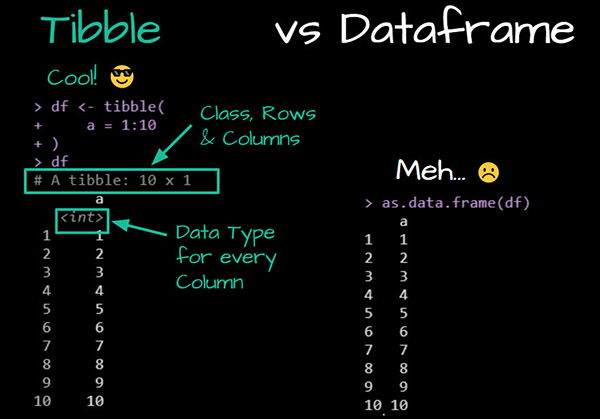

```{r setup, include=FALSE}
knitr::opts_chunk$set(echo = TRUE)
library(tidyverse)
library(palmerpenguins)
```

# Introduction to Tibbles

Tibbles are modern reimaginings of data frames in R. They come with several key benefits over traditional data frames:

- Tibbles **do not change input types** (e.g., strings stay as strings).
- Tibbles **support list-columns**.
- Tibbles **allow non-standard column names** (such as names with spaces or starting with numbers).
- Tibbles **display only the first 10 rows and all columns that fit on screen**, making them easier to read.
- They always **print column types**.



# Creating a Tibble

```{r create-tibble}
survey_tibble <- tibble(
  "index" = c(1, 2, 3, 4, 5),
  "sex" = c("m", "m", "m", "f", "f"),
  "age" = c(99, 46, 23, 54, 23)
)
survey_tibble
```

# 1. Exploring Tibbles

```{r explore}
head(survey_tibble, 2)

tail(survey_tibble, 1)

nrow(survey_tibble)

ncol(survey_tibble)

colnames(survey_tibble)

glimpse(survey_tibble)

str(survey_tibble)
```

# 2. Penguin Dataset as a Tibble

```{r penguins-tibble}
penguins_tbl <- as_tibble(penguins)
penguins_tbl
```

# 3. Indexing with Brackets

```{r indexing}
penguins_tbl[, 1] # Returns tibble
penguins_tbl[[1]] # Returns vector
penguins_tbl |> pull(species)
```

# 4. Tibbles with Non-standard Names

```{r nonstandard-names}
weird_tibble <- tibble(
  "1st column" = c(1, 2),
  "column with space" = c("A", "B")
)
weird_tibble$`1st column`
weird_tibble$`column with space`
```

# 5. Mutating and Adding Columns

```{r mutate}
penguins_tbl <- penguins_tbl |> 
  mutate(flipper_length_category = case_when(
    flipper_length_mm < 190 ~ "short",
    flipper_length_mm >= 190 ~ "long"
  ))
head(penguins_tbl)
```

# 6. Filtering Rows

```{r filter}
penguins_tbl |> filter(species == "Adelie")
```

# 7. Summarising Values

```{r summary}
penguins_tbl |> 
  group_by(species) |> 
  summarise(avg_bill = mean(bill_length_mm, na.rm = TRUE))
```

# 8. Selecting Columns

```{r select}
penguins_tbl |> select(species, island, flipper_length_mm)
```

# 9. Sorting Rows

```{r sort}
penguins_tbl |> arrange(desc(body_mass_g))
```

# 10. Saving the Tibble

```{r save}
write_csv(penguins_tbl, "penguins_cleaned.csv")
```

# Exercises

1. Create a tibble with at least 4 columns and 5 rows containing both numeric and character data.
2. Add a column to the penguins tibble using `mutate` that classifies penguins by body mass (light, medium, heavy).
3. Use `filter` to extract rows for Gentoo penguins.
4. Use `select` and `arrange` to get the 5 heaviest Adelie penguins.
5. Save your tibble to a CSV file and re-import it.

# Why Prefer Tibbles Over Data Frames?

- **Print method is cleaner**: Only first 10 rows shown with data types.
- **Never converts strings to factors**.
- **Better support for programming**: Non-standard evaluation works more consistently.
- **Robust handling of unusual column names**.
- **Safe subsetting**: No accidental vector conversion.

# Further Reading

- [Tibble documentation](https://tibble.tidyverse.org/)
- [Tibble vignette on CRAN](https://cran.r-project.org/web/packages/tibble/vignettes/tibble.html)
