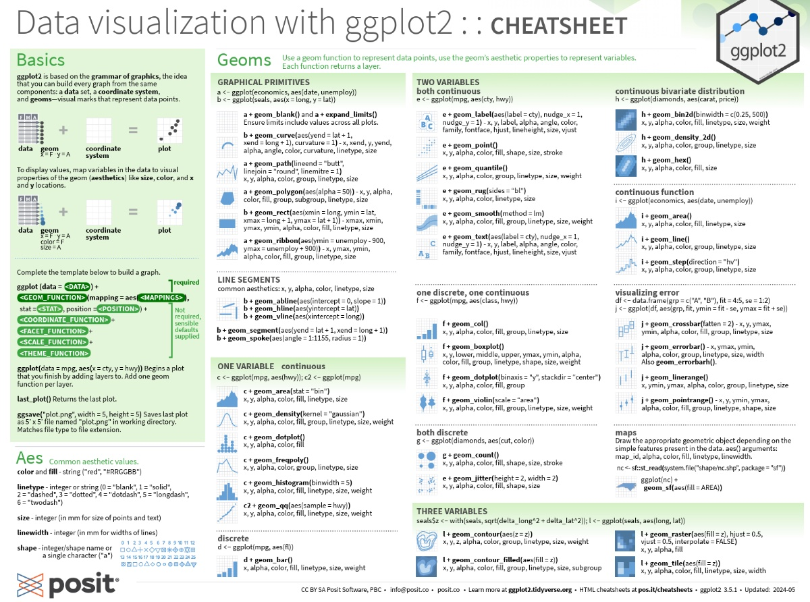
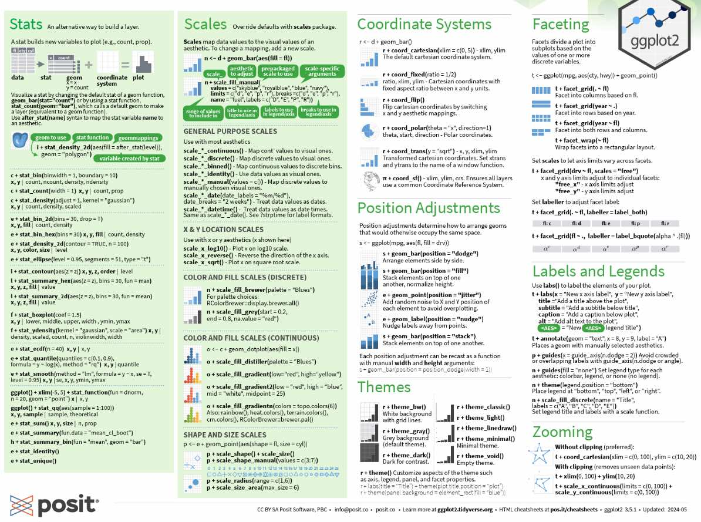

---
title: "Mapping Variables to Aesthetics in ggplot2"
output: html_document
---

```{r setup, include=FALSE}
knitr::opts_chunk$set(echo = TRUE)
library(tidyverse)
library(palmerpenguins)
library(RColorBrewer)
library(patchwork)
# BiocManager::install("showtext")
library(showtext)
# BiocManager::install("colorBlindness")
library(colorBlindness)
```

## Introduction


Welcome to this session on **Mapping Variables to Aesthetics in ggplot2**. In this lesson, we’ll explore how to make your plots more informative and accessible using aesthetics like color, shape, and size. Let’s begin!

---

## 1. Color Aesthetic (Categorical Variable)

```{r color-categorical}
ggplot(penguins, aes(x = flipper_length_mm, y = body_mass_g, color = species)) +
  geom_point() +
  theme_minimal()
```

---

## 2. Custom Colors

```{r custom-colors}
pal <- c("Adelie" = "#FF8C00", "Chinstrap" = "#A034F0", "Gentoo" = "#159090")
ggplot(penguins, aes(x = flipper_length_mm, y = body_mass_g, color = species)) +
  geom_point() +
  scale_color_manual(values = pal) +
  theme_minimal()
```

---

## 3. Color Brewer Palettes

```{r brewer-colors}
ggplot(penguins, aes(x = flipper_length_mm, y = body_mass_g, color = species)) +
  geom_point() +
  scale_color_brewer(palette = "Set1") +
  theme_minimal()
```

---

## 4. Shape Aesthetic

```{r shape-aesthetic}
ggplot(penguins, aes(x = flipper_length_mm, y = body_mass_g, shape = species)) +
  geom_point(size = 3) +
  theme_minimal()
```

---

## 5. Size Aesthetic (Continuous Variable)

```{r size-aesthetic}
ggplot(penguins, aes(x = flipper_length_mm, y = body_mass_g, size = bill_length_mm)) +
  geom_point(alpha = 0.7) +
  theme_minimal()
```

---

## 6. Redundant Aesthetics (Color + Shape)

```{r redundant-aesthetics}
ggplot(penguins, aes(x = flipper_length_mm, y = body_mass_g, color = species, shape = species)) +
  geom_point(size = 3) +
  theme_minimal()
```

---

## 7. Accessible Color Check

```{r accessibility-check}
p <- ggplot(penguins, aes(x = flipper_length_mm, y = body_mass_g, color = species)) +
  geom_point() +
  scale_color_brewer(palette = "Set1")
p
cvdPlot(p)
```

---

## 8. Axis Scaling and Labels

```{r axis-scaling}
ggplot(penguins, aes(x = flipper_length_mm, y = body_mass_g, color = species)) +
  geom_point() +
  scale_x_continuous(limits = c(170, 230), breaks = seq(170, 230, 10)) +
  scale_y_continuous(limits = c(2700, 6300), breaks = seq(3000, 6000, 500)) +
  labs(x = "Flipper Length (mm)", y = "Body Mass (g)") +
  theme_minimal()
```

---

## 9. Faceting

```{r faceting}
ggplot(drop_na(penguins), aes(x = flipper_length_mm, y = body_mass_g, color = species)) +
  geom_point() +
  facet_wrap(~sex) +
  theme_minimal()
```

---

## 10. Patchwork Composition

```{r patchwork}
p1 <- ggplot(penguins, aes(x = flipper_length_mm, y = body_mass_g, color = species)) +
  geom_point() + scale_color_manual(values = pal) + theme_minimal()

p2 <- ggplot(penguins, aes(x = penguins$bill_length_mm, y = body_mass_g, color = species)) +
  geom_point() + scale_color_manual(values = pal) + theme_minimal()

p3 <- penguins |> 
  group_by(sex, species) |> 
  summarise(n = n(), .groups = "drop") |> 
  drop_na(sex) |> 
  ggplot(aes(x = species, y = n, fill = sex)) +
  geom_col(position = position_dodge()) +
  scale_fill_manual(values = c("darkorange1", "azure4")) +
  theme_classic()

(p1 + p2) / p3 + plot_layout(guides = "collect")
```

---

## Exercise

Try customizing the color palette and adding size and shape aesthetics to a plot showing the relationship between `bill_length_mm` and `body_mass_g`.

---

## Save Your Plot

```{r save-plot, eval=FALSE}
ggsave("outputs/ggplot_custom_plot.png", dpi = 300)
```

---

## Summary

You now know how to:
- Map variables to aesthetics like color, size, and shape
- Customize color palettes
- Use faceting and patchwork for layout
- Improve accessibility of your plots

Happy plotting!

https://rstudio.github.io/cheatsheets/data-visualization.pdf



for more
https://clauswilke.com/dataviz/
