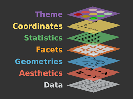
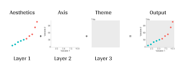

---
title: "Creating Basic Plots with ggplot2"
output: html_document
---

```{r setup, include=FALSE}
knitr::opts_chunk$set(echo = TRUE)
library(tidyverse)
library(palmerpenguins)
```

# Introduction to ggplot2 and the Grammar of Graphics



Welcome everyone! Today, we are going to explore the basics of data visualization using `ggplot2`. We'll be using the *penguins* dataset and learning how to create scatterplots, barplots, boxplots, and line plots. The philosophy of ggplot2 is based on the **grammar of graphics**, where each plot is built using layers of components.

---

## Example 1: Basic Plot Structure

```{r}
penguins %>%
  ggplot()

  ggplot(data = penguins)
```

This creates an empty plot background. You can also write:

```{r}
ggplot(data = penguins)
```

---

## Example 2: Aesthetics - Mapping Variables

```{r}
penguins %>%
  ggplot(aes(x = flipper_length_mm, y = body_mass_g))
```

We now have axes, but we need to specify how to display the data.

---

## Example 3: Scatterplot with geom_point

```{r}
penguins %>%
  ggplot(aes(x = flipper_length_mm, y = body_mass_g)) +
  geom_point()
```

---

## Example 4: Scatterplot Colored by Species

```{r}
penguins %>%
  ggplot(aes(x = flipper_length_mm, y = body_mass_g, colour = species)) +
  geom_point()
```

---

## Example 5: Adding a Trend Line

```{r}
penguins %>%
  ggplot(aes(x = flipper_length_mm, y = body_mass_g, colour = species)) +
  geom_point() +
  geom_smooth(method = "lm", se = F)
```
```{r}
penguins %>%
  ggplot(aes(x = flipper_length_mm, y = body_mass_g, colour = species)) +
  geom_point() +
  geom_smooth(method = "lm", se = F) +
  geom_jitter()
```

---

## Example 6: Using geom_jitter to Reduce Overplotting

```{r}
ggplot(data = penguins, aes(x = species, y = flipper_length_mm)) +
  geom_jitter(aes(color = species), width = 0.1, alpha = 0.7, show.legend = FALSE)
```

---

## Example 7: Boxplot

```{r}
ggplot(data = penguins, aes(x = species, y = flipper_length_mm)) +
  geom_boxplot(aes(fill = species), alpha = 0.7, width = 0.5, show.legend = FALSE)
```

---

## Example 8: Barplot - Count of Species

```{r}
penguins %>%
  ggplot(aes(x = species)) +
  geom_bar(fill = "steelblue")
```

---

## Example 9: Line Plot - Mean Body Mass per Species

```{r}
penguins %>%
  group_by(species) %>%
  summarise(mean_mass = mean(body_mass_g, na.rm = TRUE)) %>%
  ggplot(aes(x = species, y = mean_mass, group = 1)) +
  geom_line() +
  geom_point()
```

---

## Example 10: Faceting - Separate Plots per Island

```{r}
penguins %>%
  ggplot(aes(x = flipper_length_mm, y = body_mass_g, colour = species)) +
  geom_point() +
  facet_wrap(~ island)
```


---

# Exercise

Try modifying the scatterplot to color by `sex`, or try changing the plot type to `geom_boxplot()` grouped by `island`.

Happy plotting!
```{r}
penguins %>%
  ggplot(aes(x = flipper_length_mm, y = body_mass_g, colour = sex)) +
  geom_point() +
  labs(
    title = " Penguins: Body Mass vs Filpper Length",
    x = "Flipper Length (mm)",
    y = "Body Mass (g)"
  ) +
  facet_wrap(~ island)
```

```{r}
penguins %>%
  ggplot(aes(x = island, y = body_mass_g, fill = island)) +
  geom_boxplot() +
  labs(
    title = " Distribution of Body Mass by Island",
    x = "Island",
    y = "Body Mass (g)"
  )
```

