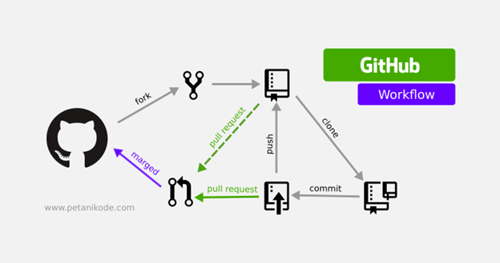

---
title: "Working with GitHub and Git in R Projects"
author: "Ehsan Zangene"
output:
  html_document:
    toc: true
    toc_depth: 2
    number_sections: true
---

```{r setup, include=FALSE}
knitr::opts_chunk$set(echo = TRUE)
```

# 🐙 1. Creating a GitHub Repository

1. Go to [GitHub](https://github.com) and sign in or create an account.
2. Click the **+** icon on the top right and choose **New repository**.
3. Name your repository, e.g., `myproject`, and add a description.
4. (Optional) Add a README and choose a license.
5. Click **Create repository**.

# 🔐 2. Connecting Your Computer Using SSH Key

## Step 1: Generate SSH Key

Open your terminal and run:

```bash
ssh-keygen -t ed25519 -C "your_email@example.com"
```

Press enter through the prompts.

## Step 2: Add SSH Key to GitHub

1. Run `cat ~/.ssh/id_ed25519.pub` and copy the output.
2. Go to **GitHub > Settings > SSH and GPG keys**.
3. Click **New SSH key**, paste the key, and save.

# 💻 3. Clone Repository Locally

```bash
git clone git@github.com:yourusername/myproject.git
```

# 🛠️ 4. Making Changes and Pushing

```bash
cd myproject
echo "# My New Project" >> README.md
git add README.md
git commit -m "Add README"
git push origin main
```

# 🤝 5. Working with a Team

## Branching vs Forking

- **Branching** is for feature development within the same repo.
- **Forking** creates your own copy of the repo (common for open-source).

## Create a Branch

```bash
git checkout -b new-feature
```

## Push a Branch

```bash
git push origin new-feature
```

## Merge Pull Request on GitHub

Team members can review and merge changes via pull requests (PRs).

# 🔄 6. Version Control & Collaboration Tips

- Use clear commit messages: `git commit -m "Fix typo in README"`
- Pull latest before pushing: `git pull origin main`
- Resolve conflicts locally if needed.

# 🧪 7. Example with RStudio Projects

1. In RStudio: **New Project > Version Control > Git**
2. Paste the GitHub URL and choose a directory.
3. Use Git tab in RStudio for add, commit, pull, push.
4. Collaborate on branches and merge via PRs.

# 🧠 Summary

- GitHub allows online repo hosting.
- SSH ensures secure connection.
- Git handles version control and collaboration.
- Branching is internal; forking is external collaboration.

# 📎 Resources

- [Happy Git and GitHub for the useR](https://happygitwithr.com/)
- [GitHub Docs](https://docs.github.com/en)
